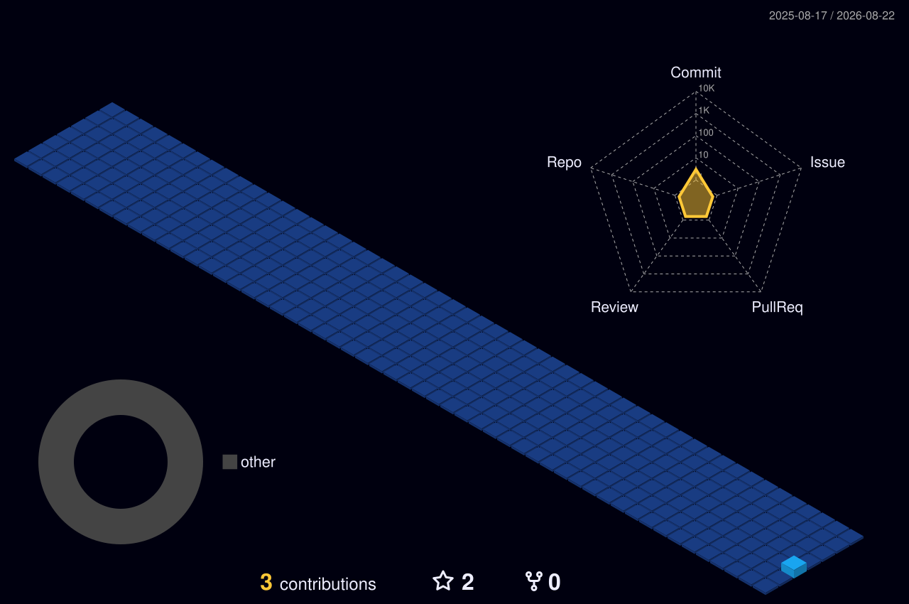

<h1 align="center">
    
</h1>

<h2 align = "Center">:open_file_folder: Sobre mim :open_file_folder:</h2>

🎓 Formado em Gestão de TI  
👨‍💻 Desenvolvedor .NET C# | Razor, HTML, CSS, JavaScript  
🔧 Experiência com Git, Linux, Azure DevOps e Power BI  
🚀 Apaixonado por resolver problemas reais com tecnologia  
📚 Sempre aprendendo: Backend,Frontend, dados e boas práticas de código  
 

 
 

 

<h2 align="center">⚒️ Linguagens & Frameworks ⚒️</h2>
 

    
     

 

  <h2>📌 Contribuições 📌</h2>
   
   
  
  
 |  |  |  
 | ----------- | ----------- |
   

 <h2 align="center">⚡ Stats ⚡</h2>
 

  
  
   

