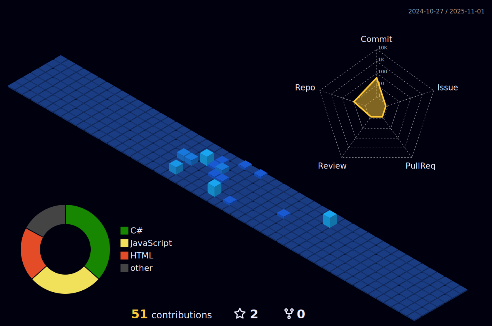

<h1 align="center">
    
</h1>

## Hi there! My name is Lucas and here you gonna find all my projects evolution and knowledge into my developer's journey

 
 

<h2 align="center">⚒️ Languages-Frameworks-Tools ⚒️</h2>
 

    
     

  <h2>📌 My Contributions 📌</h2>
   
   
  
  
 |  |  |  
 | ----------- | ----------- |
   

 <h2 align="center">⚡ Stats ⚡</h2>
 

  
  
   

